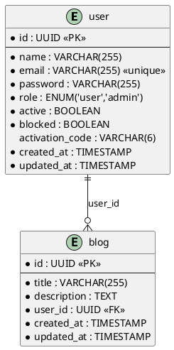

# Database Diagram

Diagrama de entidades de las tablas `user` y `blog`.

> Ver diagrama renderizado: [plantuml.com](https://www.plantuml.com/plantuml/uml/dP9FIyD05CJl-HIFN5ABkGZr449fr8YbfYqr4MzXctsKnSrkt3-Aj7vtsRhHKYg8rvdXzuRXJRGXojYM1m4AmymxX5QZ2c4R000CWL58eAgcDv2cozbul9VZsBk2j0W9F6QhwxjiDRWOZSwyWorX_CY2DBM2lLZqc25qHEitgUXfXfBSqVDvLGmYLoiwZmXjcOZw16aCUtMPgyNYFi_cNbvpsJmZFTBtOMAO57KZwM7lovxNA2G6QKqC951EY_oXp8gbDsr7JvaVFzEjkTpyTJh33FzbEugwKQnpJTsb_Adi6sXKzI7sTlOzvJ-hEoJiTd4ijsws3IHV7r0p6WR110MrBVy4)

**Convenciones:**
- `*` = campo requerido (NOT NULL)
- sin `*` = nullable
- `<<PK>>` = primary key
- `<<FK>>` = foreign key
- `||--o{` = un user tiene cero o muchos blogs
